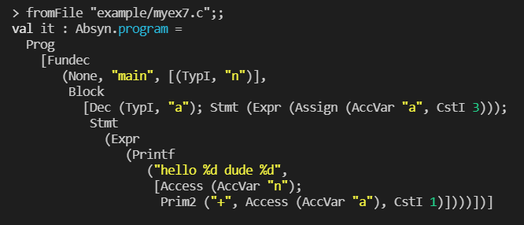
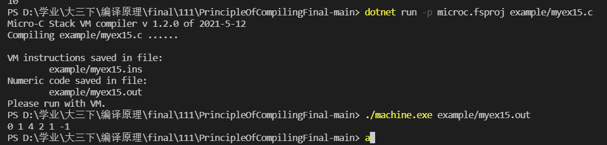
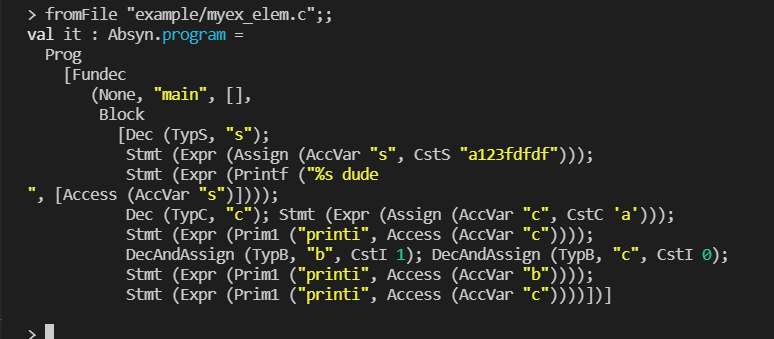
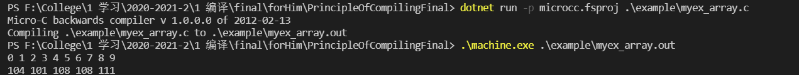
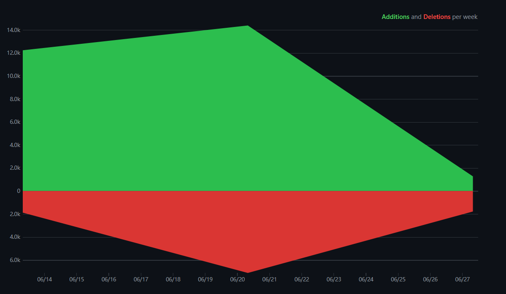

# 2020-21学年第2学期

## 实 验 报 告

{width="1.5208333333333333in" height="1.5208333333333333in"}


- 课程名称: <u>编程语言原理与编译</u>

- 实验项目: <u>期末大作业</u>

- 专业班级: <u>计算机1801，计算机1802</u>

- 学生学号: <u>31801067，31801102</u>

- 学生姓名: <u>厉潇禛，蔡伟斌</u>

- 实验指导教师:  <u>郭鸣</u>

- [github](https://github.com/ShelbyLi/PrincipleOfCompilingFinal)

------


## 引言

### 项目背景

​		编译原理是对高级程序语言进行翻译的一门科学技术，内容包括语言和文法、词法分析、语法分析、语法制导分析、中间代码生成、存储管理、代码优化和目标代码生成。虽然仅有少数人会专门从事该方向的工作，但对每一个计算机学子来说理解程序语言背后运行的逻辑过程仍然是十分重要的。在接受了相关原理性质和高度抽象的知识后，为了进一步地理解和运用编译原理的知识，我们使用F#来制作一门新的语言。

### 项目目标

解释器，编译器，优化编译器

（编译：在内存中运行、编译保存并执行、编译保存执行并在控制台输出结果、检测语法错误）

- 词法
  - 注释表示方式 :  `//` 	`/* */`    `(* *)`
  - 常量定义
    - 字符串常量
    - 数值常量：二进制`0b`、八进制`0o`、十六进制`0x`
  - 标识符定义
    - 变量名以字母或_开头
-  语法
  - 变量初始化
  - 选择结构
    - `if - else if - else` 条件语句：
      - 单分支、双分支、多分支
    - `switch-case` 判断语句
  - 循环结构
    - `for`循环语句
      - 普通 `for` 循环语句
      - `for-in` 循环语句
    - `while` 循环语句
    - `do-while` 循环语句
  - 条件运算符
    - `? :` 三目运算符
  - `break` 与 `continue` 语句
- 语义
  - 静态作用域
  - 中间代码生成 AST
- 特性
  - 位运算 
    - `&`与， `|` 或， `^` 异或，`~`  取反
    - `<< ` 左移，`>> ` 右移
  - 逻辑运算
    - `==` 等于，`!=` 不等于
    - `<` 小于，`<=` 小于等于，`>` 大于，`>=` 大于等于
    - `&&`  与，`||`  或，`!`  非
  - 自增自减运算符
    - `++`，`--`
  - 复合赋值运算符
    - `+=`，`-=`，`*=`，`/=`，`%=`
  - `struct` 结构
  - 全局变量
  - 自定义函数
  - `int` 整数类型，`char` 字符类型， `bool` 布尔类型，`float` 浮点数类型、`String` 字符串类型
  - 数组 `int[]`，`float[]`，`char[]`
  - 指针变量
  - `try-catch` 异常与捕获
- 虚拟机
  - 虚拟机类型
  - 虚拟机异常
  - 其他运算指令
- 测试
  - 语法部分测试
  - 词法部分测试
  - 语义部分测试
  - 特性部分测试
- 文档编写


## 文件结构 

- 前端：由`F#`语言编写而成  
  - `Absyn.fs`: 抽象语法树结构的定义
  - `CLex.fsl`: 词法定义
    - `CLex.fs`：由`CLex.fsl`生成的词法分析器
  - `CPar.fsy`: 语法定义
    - `CPar.fs`：由`CPar.fsy`生成的语法分析器
  - `Parse.fs`: 语法解析器（从文件或字符串中获取抽象语法树）
  - `Interp.fs`: 解释器
  - `Comp.fs`: 编译器
  - `Contcomp.fs`: 优化编译器
  - `Machine.fs`: 栈式虚拟机指令的定义及将其转化为机器指令序列
- 后端：由`C`语言编写而成
  
  - `machine.c`: 栈式虚拟机
- 测试：测试程序放在`example`文件夹内

  


## 使用方法

### 解释器

```sh
dotnet restore  interpc.fsproj
dotnet clean  interpc.fsproj
dotnet build -v n interpc.fsproj
dotnet run -p interpc.fsproj .\example\myex1.c 3  # 解释执行
```

### 编译器

```sh
dotnet restore  microc.fsproj
dotnet clean  microc.fsproj
dotnet build  microc.fsproj  
gcc machine.c -o machine  # 不用每次  改了machine.c再编译过即可

dotnet run -p microc.fsproj .\example\myex1.c 3  # 编译
.\machine.exe .\example\myex1.out 3  # 执行
```

### **优化编译器**

```shell
dotnet restore  microcc.fsproj
dotnet clean  microcc.fsproj
dotnet build  microcc.fsproj
dotnet run -p microcc.fsproj .\example\myex1.c 3
.\machine.exe .\example\myex1.out 3
```

### 查看中间过程

 编译器

```shell
# 启动fsi
dotnet fsi
#r "nuget: FsLexYacc";;

#load "Absyn.fs"  "CPar.fs" "CLex.fs" "Debug.fs" "Parse.fs" "Machine.fs" "Backend.fs" "Comp.fs" "ParseAndComp.fs";; 

open ParseAndComp;;

compileToFile (fromFile "example\ex1.c") "ex1";; 

#q;;
```

 优化编译器

```sh
dotnet fsi
#r "nuget: FsLexYacc";;

#load "Absyn.fs"  "CPar.fs" "CLex.fs" "Debug.fs" "Parse.fs" "Machine.fs" "Backend.fs" "Contcomp.fs" "ParseAndContcomp.fs";;

open ParseAndContcomp;;

fromFile "example\myex1.c";;
contCompileToFile (fromFile "example\myex1.c") "myex1.out";;

#q;;
```

## 功能实现

注：编译器的虚拟指令可运行查看.ins文件

### 词法功能

##### 注释表示方式

- 实现注释表达方式  `//` 	`/* */`    `(* *)`

- 测试样例 (myex20.c)

  ```c
  void main() {
      int i = 5;
      (*i = 10;*)
      print i;
  }
  ```
  
- 测试结果

  解释：

  
  
  编译：
  
  
  
  查看中间AST生成：
  
  
  
  优化编译虚拟指令序列：
  
  

##### 数值常量定义

- 实现二进制`0b`、八进制`0o`、十进制、十六进制`0x`数值常量

- 测试样例 (myex16.c)

  ```c
  void main() {
  	int a;
  	int b;
  	int c = 0b10;
  	// a = 1;
  	a = 0O12;
  	b = 0X1a;
  
  	print a;
  	print b;
  	print c;
      // printf("%d\n", a);
  	// printf("%d\n", b);
      // printf("%d", c);
  
  }
  ```

- 测试结果

  解释：

  
  
  编译：
  
  
  
  中间生成AST：
  
  
  
  优化编译虚拟指令序列：
  
  
  
  

##### 标识符定义

可以用`_`开头

- 测试样例1  (myex18.c)

  ```c
  void main() {
  	int a = 1;
  	int _b = 2;
  	// int __c = 3;
  
  	print a;
  	print _b;
  	// print c;
  
  }
  ```

  

- 测试结果

  解释：

  
  
  编译：
  
  
  
  中间生成AST：
  
  
  
  优化编译虚拟指令序列：
  
  

### 语法功能

##### 变量初始化

- 测试样例 (myex10.c)

  ```c
  void main(int n) { 
    int i=n;
    // int i;
    // i = 0;
    print i;
    int g = i + 1;
    print g;
  }
  ```

- 测试结果
  
  解释：
  
  
  
    编译：
  
    
  
    中间生成AST：
  
    
  
  优化编译虚拟指令序列：
  
  

##### `switch-case` 判断语句 (无break)

- 测试样例 (myex6.c)

  ```c
  void main(int n ) {
      switch (n) {
          case 0: 
              print 0;
          case 1:
              print 1;
          default:
              print -1;
      }
  }
  
  ```
  
- 测试结果

  解释：

  

  编译：

  
  
  中间生成AST：
  
  
  
  优化编译虚拟指令序列：
  
  

##### `for` 循环语句  

- 测试样例 (myex3.c)

```c
void main(int n) { 
  int i = 0;
  int j;

  for (i=0; i<n; i=i+1) {
    print i;
    for(j=0; j<i; j=j+1) {
      print j;
    }
  }
 
}
```

- 测试结果

  解释：

  
  
  编译：
  
  
  
  中间生成AST：
  
  
  
  优化编译虚拟指令序列：
  
  

##### `do-while` 循环语句

- 测试样例1 (myex5.c)

  ```c
  void main(int n ) {
     int i = 0;
     do {
         print i;
         i += 1;
     }while(i < n);
  }
  ```
  
- 测试结果1

  解释：

  

  编译：

  

  中间生成AST：

  

  优化编译虚拟指令序列：
  
  
  
  

##### `? :` 三目运算符

- 测试样例1 (myex2.c)

  ```c
  void main(int n ) {
         n==8? print 1: print 0;
  //    if(n==8){
  //     print 1;
  //    }
  //    else
  //    {
  //     print 0;
  //    }
  }
  ```
  
- 测试结果

  解释：

  

  编译：

  

  中间生成AST：

  
  
  优化编译虚拟指令序列：
  
  

##### `break` 与 `continue` 语句

- 测试样例 (myex9.c)

  ```c
  void main(int n) { 
    int i; 
    i=0; 
    while (i < 3) { 
      if (i == 1) {
          i = i + 1;
          continue;
      }
      print i; // 测试1
      // break; // 测试2
  
      i=i+1;
    } 
  }
  
  ```

- 测试结果

  编译：

  continue:

  

  break：

  
  
  中间生成AST：
  
  
  
  优化编译虚拟指令序列：
  
  
  
  

##### `printf`

- 测试样例 (myex7.c)

  ```c
  void main(int n) {
    int a;
    a = 3;
    printf("hello %d dude %d" , n, a+1);
  }
  ```

- 测试结果

  解释：

  

  中间生成AST：

  


##### `String` 

- 测试样例 (myex12.c)

  ```c
  void main() { 
    String s;
    s = "a123fdfdf";
    printf("hello %s dude\n", s);
    printf("i am d %d", s);
  }
  ```

- 测试结果

  解释：

  

  中间生成AST：
  
  

##### `do until` 

- 测试样例（myex22.c）

  ```c
  void main() {
      int i = -5;
      do {
          print i;
          i++;
      } until(i == 0);
  
  }
  ```

  

- 测试结果

  解释：

  

  编译：

  

  中间生成AST：

  

  优化编译虚拟指令序列：

  

  


### 语义功能

##### 静态作用域

- 作用域：变量是名字与实体的绑定，一段程序代码中所用到的名字并不总是有效的，而限定这个变量名的可用代码范围就是这个名字的作用域。其中分为动态作用域和静态作用域，动态作用域指函数的作用域是在函数被调用时才决定的，而静态作用域则是在编译时就已经决定了。

- 本语言采用静态作用域规则。如下样例，先将全局变量x进行赋值，随后调用 `f()` ，在函数`f`中定义局部变量x，并在函数`f`内部调用 `g()` ，查看在函数`g`中打印出的变量x值为函数f中的局部变量值还是全局变量值来判断是静态还是动态。

- 测试样例 (myex_static.c)

  ```c
  
  int x;
  int g() {
      print x;
      // return 0;
  }
  
  int f() {
      int x = 3;
      return g();
  }
  
  int main(){
       x = 10;
       f();
  }
  ```

- 测试结果

  解释：从此可看出函数g中调用的是全局变量的值，所以为静态作用域

  

  编译：
  
  
  
  中间生成AST：从中可看出函数g中的x调用外部的全局变量x
  
  
  
  优化编译虚拟指令序列：
  
  

##### 中间代码生成

- 以抽象语法树  `AST` 的形式表示中间代码生成
  - `AST` 是不包含非终结符的节点的解析树
  - 执行`fromFile "example/myex22.c";;` 生成抽象语法树
  - 执行 `contCompileToFile (fromFile "example/myex22.c") "example/myex22.out";;` 可由抽象语法树  `AST` 生成虚拟机指令序列，保存在 `myex22.out`中
- 中间代码的作用
  - 简化对新架构平台的支持
    - 隔离前端与后端
  - 简化对多种语言的支持
    - 不同的语言可以共享IR和后端
  - 支持机器无关的优化

### 特性功能

##### 位运算 

- 实现位运算`&`与， `|` 或， `^` 异或，`~`  取反，`<< ` ，左移，`>> ` 右移

- 测试样例 (myex15.c )

  ```c
  void main() {
  	int a;
  	int b;
  	int c;
  	a = 1;
  	b = 0;
  	c = a&b;
    print c;
  	c = a|b;
    print c;
    c = a << 2;
    print c;
    c = c >> 1;
    print c;
    c = a ^ b;
    print c;
    c = ~b;
    print c;
    // printf("%d", c);
    // printf("%d", c);
  	// print(a & b);
  	// print(a | b);
  	// print(~a);
  	// print(a << 1);
  	// print(a >> 1);
  	// print(b ^ c);
  }
  ```

- 测试结果

  解释：

  

  编译：

  
  
  中间生成AST：
  
  
  
  优化编译虚拟指令序列：
  
  

##### 逻辑运算

- 实现逻辑运算`==` 等于，`!=` 不等于，`<` 小于，`<=` 小于等于，`>` 大于，`>=` 大于等于，`&&`  与，`||`  或，`!`  非

- 测试样例 (myex_logis.c)

  ```c
  void main(){
      print (0==4)&&(2!=1);  // 0
      print (3>6)||(6<10);    // 1
      print (2>=1)&&(3<=7);   // 1
      print !(9>4);           // 0
  }
  ```
  
- 测试结果

  解释：

  

  编译：
  
  
  
  生成中间AST：
  
  
  
  优化编译虚拟指令序列：
  
  

##### 运算符

- 实现 `i++`，`i--`，`++i`，`--i` 自增自减运算符

- 测试样例 (myex1.c)

  ```c
  void main(int n) { 
    print n;
    print ++n;
    print n;
  
    print n;
    print --n;
    print n;
  
    print n;
    print n++;
    print n;
  
    print n;
    print n--;
    print n;
  }
  
  ```
  
- 测试结果

  解释：

  

  编译：

  

  生成中间AST：

  

  优化编译虚拟指令序列：

  

##### 复合赋值运算符 `+=`，`-=`，`*=`，`/=`，`%=`  

- 测试样例（myex4.c）

  ```c
  void main(int n) {
      print n;
      n += 2;
      print n;
      n -= 2;
      print n;
      n *= 2;
      print n;
      // n /= 2;
      // print n;
      n %= 2;
      print n;
  }
  
  ```

- 测试结果

  解释：

  

  编译：

  

  生成中间AST：

  

  优化编译虚拟指令序列：

  

##### `struct` 结构

​	首先，先创建结构体定义表，用来查找，结构体定义表中包含结构体的总体大小，名字，以及变量和偏移量。然后查找结构体变量表，加入该变量到varEnv中，访问成员时，便可以通过`.`运算符，通过偏移值转化为简单指令集。

- 测试样例 (myex14.c)

  ```c
  struct test {
    int i;
    char c;
    // String s;
    int a[3];
  };
  
  void main() { 
    // i = 3;
    // printf("%d", i);
    struct test t;
    struct test t2;
    t.i = 3;
    t.c = 'b';
    // t2.i = 7;
    // t.a[0] = 5;
    // t.s = "abcc";
    // print t.i;
    // print t.c;
    // print t2.i;
    printf("%d\n", t.i);
    printf("%c\n", t.c);
    // printf("%d\n", t2.i);
    // printf("%s\n", t.s);
  }
  ```

- 测试结果

  解释：

  

  编译：

  
  
  生成中间AST：
  
  
  
  优化编译虚拟指令序列：
  
  

##### 自定义函数

- 测试样例 (myex_defun.c)

  ```c
  int fact(int i){
      if(i == 1){
          return 1;
      }else{
          return i * fact(i - 1);
      }
  }
  
  int main(){
      int n = 5;
      print fact(n);
  }
  ```

- 测试结果

  解释：

  

  编译：
  
  
  
  生成AST：
  
  
  
  优化编译虚拟指令序列：
  
  

##### `int` 整数类型， `float` 浮点数类型，`char` 字符类型， `bool` 布尔类型，`String` 字符串类型

- 实现变量类型 `int` 整数，`float` 浮点数，`char` 字符， `bool` 布尔，`String` 字符串

- 测试样例1 (myex_elem.c 第二个main函数)

  ```c
  void main() { 
    float f;
    f = 1.2;
    printf("I am %f haha", f);
  }
  
  ```
  
- 测试结果1

  解释：

  

  编译：（float只能用printf打印，但printf只在解释器中实现）

  

  生成AST：

  

- 测试样例2 (myex_elem.c 第一个main函数)

  ```c
  void main() { 
  
    String s;
    s = "a123fdfdf";
    printf("%s dude\n", s); 
  
    char c;
    c = 'a';
    print c;
  
    bool b = true;
    bool c = false;
  
    print b;
    print c;
  }
  ```

- 测试结果2

  解释：

  
  
  编译：
  
  
  
  中间AST：
  
  
  
  

##### 数组

- 实现数组 `int[]` ，`char[]` 

- 测试样例 (myex_array.c)

  ```c
  int main(){
      int i;
      int a[10];
      char c[5];
      c[0] = 'h';
      c[1] = 'e';
      c[2] = 'l';
      c[3] = 'l';
      c[4] = 'o';
      for(i = 0; i < 10; ++i){
          a[i] = i;
      }
      for(i = 0; i < 10; ++i){
          print a[i];
      }
      println;
      for(i = 0; i < 5; ++i){
          print c[i];
      }
  }
  ```
  
- 测试结果

  解释：

  

  编译：

  

  生成AST：

  

  

优化编译虚拟指令序列：


##### `try-catch` 异常与捕获

- 除0异常捕获：
  - 虚拟机运行时的除0异常
  - 出现显式的除0时THROW 异常

- 测试样例 (myex19.c)

  ```c
  int main(){
      try{
          int a=0;
          int n=5;
          n=n/a;
      }
      catch("ArithmeticalExcption"){
          n=0;
          print n;
      }   
  }
  ```

- 测试结果

  编译：

  

  生成AST：
  
  
  
  
  
  优化编译虚拟指令序列：
  
  

##### `Max Min Abs` 

- 测试样例 (myex21.c)

  ```c
  void main() {
      int i = -5;
      int j = -9;
      int k = Max(i, j);
      print k;
      int k1 = Min(i, j);
      print k1;
      int k2 = Abs(i);
      print k2;
  }
  ```

- 测试结果

  解释：

  

  编译：


​	中间AST：


优化编译虚拟指令序列：


##### return 静态作用域

- 测试样例 (myex23.c)

  ```c
  // int x;
  int g(int z) {
      return z+1;
  }
  int f(int y) {
      int x = y + 1;
      return g(y*x);
      // return y;
  }
  
  void main() {
      print f(3);
  }
  ```

- 测试结果

  解释：

  

  编译：

  

  中间AST：

  

  优化编译虚拟指令序列：

  

##### `int(x) char(x)`

- 测试样例（myex13.c）

```c
void main() { 
  int i = 55;
  int i1 = 56;
  char c = 98;
  float f = 99.6;
  // c = ;
  // i = (int)c;
  // i1 = (int)f;
  printf("i am char...shhh! actually i'm int... %c\n", (char)97);
  printf("i am char...shhh! actually i'm float... %c\n", (char)f);
  printf("i am int...shhh! actually i'm char... %d\n", (int)c);
  printf("i am int..shhh! actually i'm float... %d\n", (int)f);
  // printf("i am int...shhh! actually i'm char... %d\n", i);
  // printf("i am int..shhh! actually i'm float... %d\n", i1);

  // float f;
  // f=2.3;
  // c = (char)f;
  // printf("i am char %c", c);
}
```


- 测试结果

  解释：

  

  中间AST：

  

### 虚拟机

本语言编译器使用C进行编写。

- 加入了位运算、取反的指令，使相关操作得到支持。

  ```c
  #define BITAND 26
  #define BITOR 27
  #define BITXOR 28
  #define BITLEFT 29
  #define BITRIGHT 30
  #define BITNOT 31
  #define NEG 35
  ```

  

- 加入了异常处理相关的指令

  ```c
  #define THROW 32
  #define PUSHHR 33
  #define POPHR 34
  ```

  目前定义了数字计算除0的异常，可以此为模板扩展多种异常的支持。


## 心得体会

- 大项目开发过程心得
  - 厉潇禛：

    ​		本次大作业我花了一周多的时间，从毫无头绪到一点一点看着commits变多，成就感也油然而生。项目开始前，我浏览 了能够查阅到的资料，对项目进行了大致的了解。而真正的第一步，是我从该项目的来源（Programming Language Concepts for Software Developers）中，跟着Exercise8.3增加了第一个功能，即自增自减，成功之后我才开始真正入门。

    我对于解释器和编译器的理解也从只知道一个大致流程，到真正能够摸得到看得到，整个过程虽然痛苦但也不断在收获。

    ​		真正困难之一是对于F#的不熟练，但好在我觉得我的方式是正确的，我一个一个小功能增加，及时调试，能让我对于哪一块代码有问题有及时的了解。但我对于F#还远没有到熟练应用的程度，只是根据”上下文“模仿罢了。但对于开学初来说已是不小的进步，第一次接触函数式编程的不习惯到如今对这个概念渐渐熟悉，也算是很大的收获。

    ​		困难之二是对于汇编语言的不熟悉，很多时候我只能参考Cuby来修改完成，然后试着自己再改编一点别的功能。如果运行出错我只能尝试自己看一遍汇编代码来尝试自己理解，再一点点尝试修改。

    ​		我觉得成功的第一步都是模仿，事实证明也确实如此。在过程中我从模仿到渐渐开始有自己的一点小功能，对我来说是很大的进步。本学期的编译原理课程中，我收获的不仅是F#的相关知识，不仅是编译的相关知识，更是对于大学学习能力的提升和观念的转变。以前我会更在意我有没有写出一个项目，有没有弄懂一个语言，但郭老师讲计算机的学习道路抽象成”道法术“的概念，让我恍然大悟：最根本和底层的知识才是王道啊。希望在今后的学习过程中，我能够更注重对于本质的理解和学习，才能以不变应万变。

  - 蔡伟斌：

    ​		这学期的学业压力较重，且有比较倾向的研究方向导致一开始忙不过来，特别是在面对编译原理这门比较硬核的科目时，在课堂上学习到的知识总是一知半解，课后还需要在理论知识上花费大量的时间去理解，同时还要掌握一门资料比较少且从未接触过的函数式语言F#，让我个人的压力倍增。不过虽然过程很艰辛但自己对编译原理的认知和程序运行的原理与特性有了进一步的理解和认识。经历过这次大作业后，收获颇丰。

    - 了解了函数式编程语言特点与特性，拓宽视野。
    - 在实现的过程中逐渐深入了解了编译原理和计算思维。
    - 跟随着日常作业与提供的参考对程序的设计和应用有了更深的理解。
    - 我个人一般都是利用python来处理一些较大的文件来实现运用某些人工智能算法，有时候因为特征过多的原因以及在使用notebook过程中变量不会及时回收导致服务器的内存不够使用，所以在大作业的开始初期本想是去实现这一个来源于实际应用的需求，但实际因为时间紧凑而没有做深入的了解和实现，有点可惜。

- 本课程评价

  本学期课程虽然不多，但课外都需要很多时间，尤其是编译原理。

  - 由于从未接触过F#和任何别的函数式编程，能够查阅到的资料也较少，因此上手时~~一脸懵逼~~极其困难。
  - 平时的作业课外阅读很多，但很有用，尤其是一些国外课程的PPT。
  - 知识点较多，理论知识容易当场记住过会儿就忘记，同样需要课后积极付出。


## 附录

##### 权重表

| 姓名   | 学号     | 班级       | 任务                                       | 权重 |
| ------ | -------- | ---------- | ------------------------------------------ | ---- |
| 厉潇禛 | 31801067 | 计算机1801 | 功能设计,  解释器，编译器，虚拟机的编写    | 1.0  |
| 蔡伟斌 | 31801102 | 计算机1802 | 功能设计, 优化编译器的编写，测试，报告撰写 | 0.9  |

##### 代码提交日志




##### 项目自评表(1⭐-5⭐)

| 功能                                                         | **Interpret**   | **Compile**     | Contcomp | 评分  | test对应文件  |
| :----------------------------------------------------------- | --------------- | --------------- | -------- | ----- | :------------ |
| **词法**                                                     |                 |                 |          |       |               |
| 注释表示方式  `//` 、`/* */` 、 `(* *)`                      | ✔               | ✔               | ✔        | ⭐⭐⭐⭐⭐ | myex20.c      |
| 数值常量 二进制`0b`、八进制`0o`、十六进制`0x`                | ✔               | ✔               | ✔        | ⭐⭐⭐⭐⭐ | myex16.c      |
| 标识符定义，可`_`开头                                        | ✔               | ✔               | ✔        | ⭐⭐⭐⭐⭐ | myex18.c      |
|                                                              |                 |                 |          |       |               |
| **语法**                                                     |                 |                 |          |       |               |
| 变量初始化                                                   | ✔（全局未实现） | ✔（全局未实现） | ✔        | ⭐⭐⭐⭐  | myex10.c      |
| `switch-case` 判断语句，无break                              | ✔               | ✔               | ✔        | ⭐⭐⭐⭐  | myex6.c       |
| `for` 循环语句                                               | ✔               | ✔               | ✔        | ⭐⭐⭐⭐⭐ | myex3.c       |
| `do-while` 循环语句                                          | ✔               | ✔               | ✔        | ⭐⭐⭐⭐⭐ | myex5.c       |
| `? :` 三目运算符                                             | ✔               | ✔               | ✔        | ⭐⭐⭐⭐⭐ | myex2.c       |
| `break` 与 `continue` 语句                                   |                 | ✔               | ✔        | ⭐⭐⭐   | myex9.c       |
| `printf`                                                     | ✔               |                 |          | ⭐⭐    | myex7.c       |
| `char` `bool`                                                | ✔               | ✔               | ✔        | ⭐⭐⭐⭐⭐ | myex_elem.c   |
| `float`                                                      | ✔               | ✔               | ✔        | ⭐⭐⭐   | myex_elem.c   |
| `String`                                                     | ✔               |                 |          | ⭐     | myex12.c      |
| `do until`                                                   | ✔               | ✔               | ✔        | ⭐⭐⭐⭐⭐ | myex22.c      |
|                                                              |                 |                 |          |       |               |
| **语义**                                                     |                 |                 |          |       |               |
| 静态作用域                                                   | ✔               | ✔               | ✔        | ⭐⭐⭐⭐  | myex_static.c |
| 中间代码生成 AST                                             | ✔               | ✔               | ✔        | ⭐⭐⭐⭐⭐ |               |
|                                                              |                 |                 |          |       |               |
| **特性**                                                     |                 |                 |          |       |               |
| 位运算:  `&`与， `|` 或， `^` 异或，`~`  取反，`<< ` 左移，`>> ` 右移 | ✔               | ✔               | ✔        | ⭐⭐⭐⭐⭐ | myex15.c      |
| 逻辑运算:  `==` 等于，`!=` 不等于，`<` 小于，`<=` 小于等于，`>` 大于，`>=` 大于等于，`&&`  与，`||`  或，`!`  非 | ✔               | ✔               | ✔        | ⭐⭐⭐⭐⭐ | myex_logis.c  |
| 自增自减运算符 `i++`，`i--`，`++i`，`--i`                    | ✔               | ✔               | ✔        | ⭐⭐⭐⭐⭐ | myex1.c       |
| 复合赋值运算符 `+=`，`-=`，`*=`，`/=`，`%=`                  | ✔               | ✔               | ✔        | ⭐⭐⭐⭐⭐ | myex4.c       |
| `struct`                                                     | ✔               | ✔               | ✔        | ⭐⭐⭐   | myex14.c      |
| 自定义函数                                                   | ✔               | ✔               | ✔        | ⭐⭐⭐⭐⭐ | myex_defun.c  |
| `int` 整数类型，`char` 字符类型， `bool` 布尔类型，`float` 浮点数类型、`String` 字符串类型 | ✔               | ✔               | ✔        | ⭐⭐⭐   | myex_elem.c   |
| 数组 `int[]`，`char[]`                                       | ✔               | ✔               | ✔        | ⭐⭐⭐⭐⭐ | myex_array.c  |
| `try-catch` 异常与捕获                                       |                 | ✔               | ✔        | ⭐⭐    | myex19.c      |
| `Max Min Abs`                                                | ✔               | ✔               | ✔        | ⭐⭐⭐⭐⭐ | myex21.c      |
| `return`                                                     | ✔               | ✔               | ✔        | ⭐⭐⭐⭐  | myex23.c      |
| `int(x) char(x)`                                             | ✔               |                 |          | ⭐⭐    | myex13.c      |
|                                                              |                 |                 |          |       |               |
| **虚拟机**                                                   |                 |                 |          |       |               |
| 位运算等操作符                                               |                 |                 |          | ⭐⭐⭐⭐⭐ |               |
| 异常                                                         |                 |                 |          | ⭐⭐⭐⭐  |               |
|                                                              |                 |                 |          |       |               |


